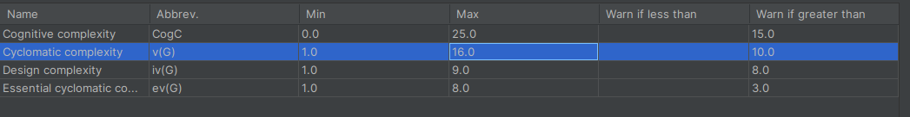
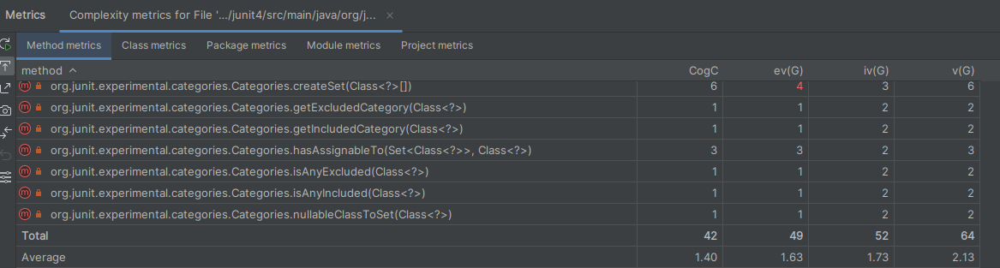
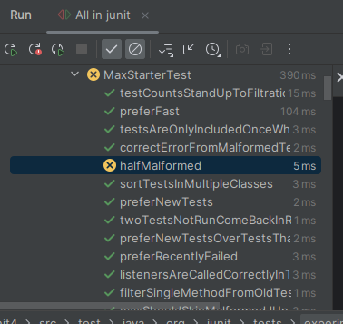
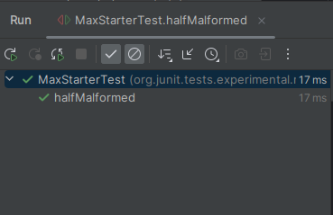

    

# Amélioration du projet : JUnit 4 

## Travail encadré par : Cyril FERLICOT

### Travail fait par :
- **ZIANI Meryem**

## Table des Matières
0. [Outils utilisés](#outils_utilisés)
1. [Petites modifications](#petites_modifications)
2. [Moyennes modifications](#moyennes_modifications)
3. [Grandes modifications](#grandes_modifications)
4. [Développement](#développement)
5. [Conclusion](#conclusion)

## Outils Utilisés
- SonarQube
- IntelliJ
- Plugin Metrics Reloaded

## Petites modification : 
### Renommage :
  
- Une classe :
  
  ***RepeatedTestCaseDecorator*** est plus descriptif que ***RepeatedTest***. Il suggère clairement que la classe est un décorateur pour les cas de test répétés, ce qui donne une meilleure idée de son objectif et de son rôle dans le code.
  
 Lien vers le commit :
[Lien vers le commit ](https://github.com/junit-team/junit4/commit/71000c03baa8f14325e4536aeb91bd2c7bff9c5b)

- Une variable :
  
  J'ai changé ***fTimesRepeat*** par ***repeatCount*** car elle est plus explicite et décrit directement le rôle de cette variable dans le contexte des tests répétés. Cela rend le code plus compréhensible pour les autres développeurs qui peuvent parcourir le code ultérieurement.
  
  Lien vers le commit :
   [Lien vers le commit ](https://github.com/junit-team/junit4/commit/f1b36e420ae9381b64fbe8d40eb4f241687a5644)

- Une méthode :
 
  J'ai changé ***compactString*** par ***compactifyString*** car il est plus descriptif et exprime clairement l'action effectuée par la méthode. Il indique que la méthode transforme ou modifie la chaîne de caractères pour la rendre plus compacte.

  Lien vers le commit :
  [Lien vers le commit](https://github.com/junit-team/junit4/commit/532403049453c6d72515fbd6f994e1ab92d5f6fb)

### Changer le nombre de paramétre :

Dans **src/main/java/junit/framework/JUnit4TestAdapterCache.java** :

J'ai supprimé l'argument ***adapter*** de la méthode ***getNotifier*** car il n'était pas utilisé dans le contexte de cette méthode. En le retirant, j'ai simplifié l'interface de la méthode et rendu le code plus clair et plus facile à comprendre pour d'autres développeurs qui pourraient travailler sur ce code à l'avenir. La suppression de cet argument réduit également la complexité du code en éliminant une fonctionnalité inutilisée, ce qui contribue à maintenir une base de code propre et cohérente.

Lien vers le commit :
  [Lien vers le commit](https://github.com/junit-team/junit4/commit/532403049453c6d72515fbd6f994e1ab92d5f6fb)

### Supprimer des nombres magiques :

L'utilisation de constantes comme ***METHOD*** au lieu de valeurs littérales directes telles que ***"Method"*** aide à éviter les "nombres magiques". Un nombre magique est une valeur codée en dur qui peut sembler arbitraire et dénuée de contexte. En définissant METHOD comme une constante avec un nom significatif, nous attribuons une signification claire à cette valeur et la rendons réutilisable et facilement identifiable dans tout le code. En conséquence, cela rend le code plus lisible, plus compréhensible et plus facile à maintenir car si jamais le libellé "Method" doit être modifié, il ne nécessite qu'une modification de la constante METHOD, plutôt que de rechercher et modifier chaque occurrence de la chaîne directement dans le code.

Lien vers le commit :
  [Lien vers le commit](https://github.com/junit-team/junit4/commit/7c7f8224c7af79a4649f3b0da44902de0181bb41)

## Moyennes modifications :

### Réduire la complexité :

Les modifications apportées à la méthode ***hasCorrectCategoryAnnotation*** visent à réduire la complexité et à améliorer la lisibilité du code. En extrayant des parties de la logique dans des méthodes privées distinctes telles que checkEmptyChildCategories et checkIncludedCategories, le code est maintenant mieux organisé et plus facile à comprendre. Les noms significatifs de ces nouvelles méthodes clarifient leur rôle dans la logique globale de la méthode, facilitant ainsi la compréhension de la fonctionnalité de chaque segment de code. De plus, la réutilisation de la logique extraites dans d'autres parties du code est facilitée, ce qui favorise une meilleure modularité et réduit la duplication de code. En consolidant les conditions et en évitant la répétition de la logique, le code est devenu plus concis tout en conservant sa fonctionnalité.

Notre complexité est passé de 46 à 42 :

Lien vers le commit :
[Lien vers le commit](https://github.com/junit-team/junit4/commit/ff27b19ce1b9826188eb11c1adddb426bcff5772)

### Lever une exception :

Lien vers le commit :
[Lien vers le commit](https://github.com/junit-team/junit4/commit/5ecb9a6d5b9e72e0a577da32d1a9de0acc64a28d)

### Passer un test orange en vert :

## Grandes modification : 

### Décomposition d'une god classe :

**Décomposition de la god classe Assert :**

La classe Assert contenait auparavant un grand nombre de méthodes pour gérer les échecs d'assertions dans nos tests unitaires. Cependant, cela entraînait une classe surchargée avec une multitude de responsabilités, ce qui la rendait difficile à maintenir et à comprendre. Pour remédier à cette situation, nous avons entrepris de décomposer la classe Assert en extrayant les méthodes liées à la gestion des erreurs d'assertions dans une classe distincte appelée Fail. Cette décomposition nous a permis de séparer les responsabilités liées à la gestion des erreurs des assertions de la logique d'assertion proprement dite. Désormais, la classe Fail est responsable de la gestion des échecs d'assertions, tandis que la classe Assert se concentre uniquement sur la logique d'assertion, ce qui rend notre code plus modulaire, plus lisible et plus facile à maintenir.

Lien vers le commit :
[Lien vers le commit](https://github.com/junit-team/junit4/commit/a9d8523358fb3fbb539d849c6d9d52847cfed647)

### Suppression d'une classe static :

La décision de supprimer la classe statique et de déplacer les constantes `TYPE_TEST_RULE` et `TYPE_METHOD_RULE` dans une classe publique ***RuleEntry*** distincte a été prise dans le but d'améliorer la structure et la maintenabilité du code. Cette approche a également facilité la réutilisation des constantes dans d'autres parties du code et a permis une meilleure encapsulation, réduisant ainsi le couplage et rendant le code plus modulaire. En conséquence, la modification a contribué à rendre le code plus clair, plus facile à comprendre et plus facile à maintenir, tout en favorisant de bonnes pratiques de conception logicielle.

Lien vers le commit :
[Lien vers le commit](https://github.com/junit-team/junit4/commit/d0af6f552036da8ebd29f33ad1f55be572f65406)

### Suppression d'un package :

Supprimer des packages contenant peu de classes est une pratique courante pour maintenir la structure et la lisibilité de notre code. Lorsqu'un package ne contient que quelques classes, il peut être difficile de justifier son existence, car cela peut introduire de la confusion et de la complexité inutile. En éliminant ces packages, vous simplifiez la hiérarchie de votre projet, ce qui facilite la navigation et la compréhension pour les développeurs. De plus, cela peut aider à prévenir la fragmentation du code en regroupant les classes connexes dans des packages plus larges et mieux organisés.

Lien vers le commit :
[Lien vers le commit](https://github.com/junit-team/junit4/commit/57c4370a1ccb4356ca8501fbd6682efd829c4b3a)

## Conclusion :

Dans l'ensemble, les modifications apportées au code ont contribué à améliorer la qualité, la lisibilité et la maintenabilité de notre base de code. En optant pour des noms de classe, de variables et de méthodes plus descriptifs, nous avons rendu notre code plus facile à comprendre pour les développeurs qui travaillent dessus. De plus, en réduisant la complexité, en éliminant les nombres magiques et en décomposant les classes trop volumineuses, nous avons favorisé une meilleure organisation du code et une réduction de la duplication, ce qui conduit à un code plus propre et plus concis. Enfin, en suivant de bonnes pratiques de conception logicielle, telles que la décomposition des classes et la suppression des classes statiques, nous avons créé une structure plus modulaire et extensible, facilitant ainsi la maintenance et l'évolutivité de notre code à long terme. En combinant ces efforts, nous avons renforcé la qualité globale de notre base de code, ce qui devrait conduire à une meilleure productivité et à une réduction des problèmes liés au développement logiciel.
